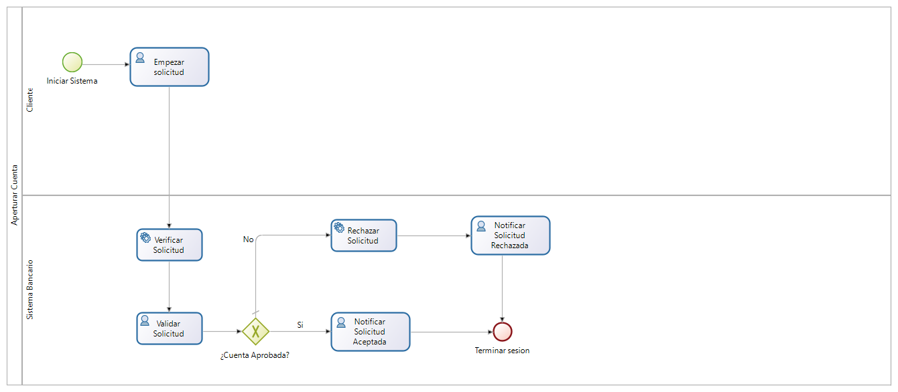
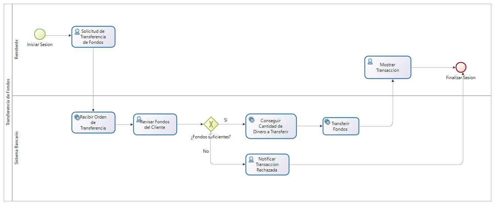
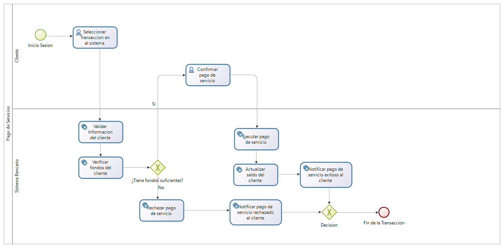
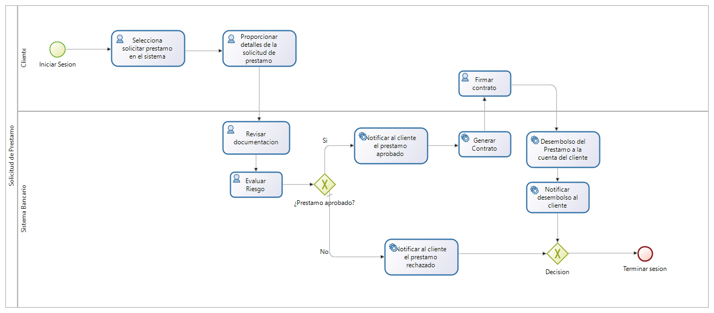
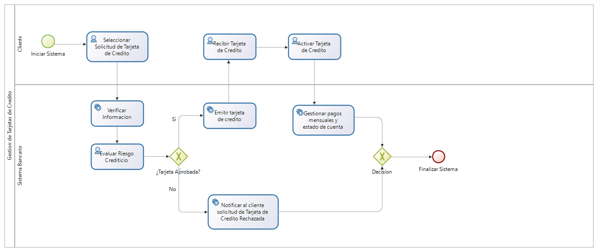

# bancoRestAPI

# Principios SOLID
### Single Responsibility Principle (SRP)
Cada clase y módulo debe tener una única responsabilidad o razón para cambiar.
* Entidades (Entities): Cada entidad, como Cliente, Cuenta, y Transferencia, tiene la responsabilidad exclusiva de representar los datos del dominio y las operaciones directamente relacionadas con esos datos.
* Servicios de Dominio: Cada servicio de dominio, como VerificacionIdentidadServicio, tiene una única responsabilidad de manejar una parte específica de la lógica de negocio.
* Repositorios: Cada repositorio, como ClienteRepositorio, tiene la responsabilidad única de manejar la persistencia de una entidad específica.

### Open/Closed Principle (OCP)
El software debe estar abierto para extensión pero cerrado para modificación.
* Interfaces y Abstracciones: Utilizamos interfaces en application/ports/inbound y application/ports/outbound para definir contratos que las implementaciones concretas deben seguir, permitiendo extender el comportamiento sin modificar las clases existentes.
* Patrón de Repositorio: Las interfaces de repositorio permiten agregar nuevas funcionalidades de persistencia sin cambiar las implementaciones existentes.

### Liskov Substitution Principle (LSP)
Los objetos de una clase base deben poder ser reemplazados por objetos de una clase derivada sin alterar el funcionamiento del programa.

* Implementaciones de Interfaces: Las implementaciones de interfaces en application/ports/outbound (como ClienteRepositorio) siguen este principio al asegurar que cualquier implementación concreta puede sustituir a la abstracción sin afectar el comportamiento esperado.

### Interface Segregation Principle (ISP)
Los clientes no deben verse obligados a depender de interfaces que no utilizan.

* Interfaces Especializadas: Las interfaces en application/ports/inbound y application/ports/outbound están diseñadas para ser específicas a sus necesidades, evitando interfaces grandes y genéricas. Por ejemplo, CuentaService y ClienteRepositorio tienen métodos específicos y relevantes a su contexto.

### Dependency Inversion Principle (DIP)
Los módulos de alto nivel no deben depender de módulos de bajo nivel, sino de abstracciones.

* Inyección de Dependencias: Utilizamos la inyección de dependencias a través de Spring para asegurar que las clases dependan de interfaces y no de implementaciones concretas. Esto se observa en la forma en que los servicios y controladores reciben sus dependencias.
* Patrón de Puertos y Adaptadores: Esta arquitectura asegura que los componentes del dominio y la lógica de negocio dependan de abstracciones definidas en los puertos y no directamente de los detalles de infraestructura.

# Domain-driven design
Entidades, Objetos de Valor, [Servicios de Dominio,] Agregados, Fábricas y Repositorios

# Patrones de Arquitectura
Arquitectura Hexagonal usando DDD


# Pruebas de APIs
## Herramienta Swagger


# Pruebas de Rendimiento
Para las pruebas de rendimiento utilizamos la herramienta JMeter, la cual nos proporcionó las pruebas a todas las funcionalidades críticas de nuestra aplicación bancaria. A continuación, se detallan los pasos y comandos utilizados para ejecutar las pruebas de rendimiento y generar los reportes correspondientes.
Link Informe: https://drive.google.com/file/d/1g6d6P7k5Loh3hLQ6jRvwHuvDR3dnyIHE/view?usp=sharing


# Pruebas de Seguridad

## Herramienta Utilizada

Link Informe: https://drive.google.com/file/d/1idunNmyrFZWGPyaF81257UjyACCMAA-w/view?usp=sharing

Para la evaluación de la seguridad de la aplicación, se utilizó OWASP ZAP (Versión 2.15.0), una herramienta open-source diseñada para encontrar vulnerabilidades en aplicaciones web.

## Parámetros del Informe
- **Fecha del escaneo**: 30 de marzo de 2024
- **Contextos**: No se seleccionó ningún contexto específico, por lo que se incluyeron todos de forma predeterminada.
- **Sitios Escaneados**: `http://localhost:8080`
- **Niveles de Riesgo Incluidos**: Alto, Medio, Bajo, Informativo
- **Niveles de Confianza Incluidos**: Confirmado por Usuario, Alta, Media, Baja

## Resumen del Informe
### Conteo de Alertas por Riesgo y Confianza
| Confianza    | Alto | Medio | Bajo | Informativo | Total |
|--------------|------|-------|------|-------------|-------|
| Alta         | 0    | 0     | 0    | 0           | 0     |
| Media        | 0    | 0     | 0    | 1           | 1     |
| Baja         | 0    | 0     | 0    | 0           | 0     |
| Confirmado   | 0    | 0     | 0    | 0           | 0     |
| **Total**    | 0    | 0     | 0    | 1           | 1     |

### Recuento de Alertas por Sitio y Riesgo
| Sitio                 | Alto | Medio | Bajo | Informativo |
|-----------------------|------|-------|------|-------------|
| http://localhost:8080 | 0    | 0     | 0    | 1           |

### Recuento de Alertas por Tipo de Alerta
| Tipo de Alerta          | Riesgo      | Cantidad |
|-------------------------|-------------|----------|
| Agente de Usuario Fuzzer| Informativo | 1        |

## Detalles de las Alertas
### Agente de Usuario Fuzzer
- **Riesgo**: Informativo
- **Confianza**: Media
- **Descripción**: El escáner activo identificó un comportamiento anómalo en la manipulación del agente de usuario.
- **Referencia**: [OWASP User Agent Fuzzer](https://www.zaproxy.org/docs/alerts/10104/)

## Acciones Recomendadas
1. **Revisión de Agente de Usuario**: Verificar las configuraciones del agente de usuario en la aplicación y ajustar según las mejores prácticas de seguridad.
2. **Mejora de Seguridad**: Implementar medidas adicionales para detectar y mitigar posibles manipulaciones de agentes de usuario.
3. **Monitoreo Continuo**: Continuar monitoreando y escaneando la aplicación regularmente utilizando herramientas como OWASP ZAP para asegurar que nuevas vulnerabilidades no sean introducidas.

## Enlaces de Referencia
- [OWASP ZAP](https://www.zaproxy.org/)
- [Guía de Pruebas de OWASP](https://owasp.org/wstg)

# Documentación de Servicios de Banco en base al estándar OpenAPI y la Herramienta Swagger

## Descripción General

Esta API permite gestionar diversos aspectos de los servicios bancarios, incluyendo clientes, cuentas, transacciones y más.

## Recursos

### Cliente
Representa a un cliente del banco.

#### Esquema
```json
{
  "Cliente": {
    "type": "object",
    "properties": {
      "id": {
        "type": "integer"
      },
      "nombre": {
        "type": "string"
      },
      "email": {
        "type": "string",
        "format": "email"
      },
      "telefono": {
        "type": "string"
      }
    }
  }
}
```

#### Operaciones

##### Obtener Lista de Clientes
Obtiene una lista de todos los clientes.

- **URL:** /api/clientes
- **Método:** GET
- **Respuesta:**
  - **Código 200:** Lista de clientes
  - **Ejemplo de respuesta:**
    ```json
    [
      {
        "id": 1,
        "nombre": "Juan Perez",
        "email": "juan.perez@example.com",
        "telefono": "123456789"
      }
    ]
    ```

##### Obtener Cliente por ID
Obtiene los detalles de un cliente específico por su ID.

- **URL:** /api/clientes/{id}
- **Método:** GET
- **Parámetros de ruta:**
  - id (integer, requerido): ID del cliente
- **Respuesta:**
  - **Código 200:** Detalles del cliente
  - **Código 404:** Cliente no encontrado
  - **Ejemplo de respuesta:**
    ```json
    {
      "id": 1,
      "nombre": "Juan Perez",
      "email": "juan.perez@example.com",
      "telefono": "123456789"
    }
    ```

##### Crear un Nuevo Cliente
Crea un nuevo cliente en el sistema.

- **URL:** /api/clientes
- **Método:** POST
- **Cuerpo de la solicitud:**
  ```json
  {
    "nombre": "Juan Perez",
    "email": "juan.perez@example.com",
    "telefono": "123456789"
  }
  ```
- **Respuesta:**
  - **Código 201:** Cliente creado
  - **Ejemplo de respuesta:**
    ```json
    {
      "id": 1,
      "nombre": "Juan Perez",
      "email": "juan.perez@example.com",
      "telefono": "123456789"
    }
    ```

##### Actualizar un Cliente
Actualiza los detalles de un cliente existente.

- **URL:** /api/clientes/{id}
- **Método:** PUT
- **Parámetros de ruta:**
  - id (integer, requerido): ID del cliente
- **Cuerpo de la solicitud:**
  ```json
  {
    "nombre": "Juan Perez",
    "email": "juan.perez@example.com",
    "telefono": "123456789"
  }
  ```
- **Respuesta:**
  - **Código 200:** Cliente actualizado
  - **Código 404:** Cliente no encontrado
  - **Ejemplo de respuesta:**
    ```json
    {
      "id": 1,
      "nombre": "Juan Perez",
      "email": "juan.perez@example.com",
      "telefono": "123456789"
    }
    ```

##### Eliminar un Cliente
Elimina un cliente del sistema.

- **URL:** /api/clientes/{id}
- **Método:** DELETE
- **Parámetros de ruta:**
  - id (integer, requerido): ID del cliente
- **Respuesta:**
  - **Código 204:** Cliente eliminado
  - **Código 404:** Cliente no encontrado

### Modelo de Datos

#### Esquema de Cliente
El modelo de datos del cliente incluye los siguientes campos:

- id (integer): ID único del cliente.
- nombre (string): Nombre del cliente.
- email (string): Dirección de correo electrónico del cliente.
- telefono (string): Número de teléfono del cliente.

#### Ejemplo de Cliente
```json
{
  "id": 1,
  "nombre": "Juan Perez",
  "email": "juan.perez@example.com",
  "telefono": "123456789"
}
```

## Servidor

- **Base URL:** http://localhost:8080/swagger-ui/index.html

## Herramienta Swagger


Este proyecto demuestra cómo aplicar principios de DDD junto con una arquitectura hexagonal para construir sistemas robustos y mantenibles. A través de pruebas rigurosas de API, rendimiento y seguridad, se asegura que el sistema no solo sea funcional, sino también eficiente y seguro.
# Prácticas BPM

## Procesos de Negocio

### 1. Proceso de Apertura de Cuentas

#### 1.1. Modelo y Descripción del Modelo
Permite abrir cuentas bancarias a los nuevos clientes.

#### 1.2. Roles Involucrados
- **Cliente**: Persona que solicita la apertura de una cuenta bancaria.
- **Sistema Bancario**: Plataforma tecnológica utilizada para gestionar las cuentas bancarias.

#### 1.3. Actores
- **Solicitante**: Cliente que inicia el proceso de apertura de cuenta.
- **Oficial de Servicio al Cliente**: Empleado del banco que asiste al solicitante en el proceso de apertura de cuenta.

#### 1.4. Diagrama


### 2. Proceso de Transferencias de Fondos

#### 2.1. Modelo y Descripción del Modelo
Gestiona las transferencias de fondos entre cuentas dentro del banco.

#### 2.2. Roles Involucrados
- **Remitente**: Persona que realizara la transaccion a otra cuenta que sera el destinatario.
- **Sistema Bancario**: Plataforma tecnológica utilizada para gestionar la transaccion.

#### 2.3. Actores
- **Remitente**: Cliente que inicia el proceso de solicitud de transaccion de fondos.
- **Oficial de Tranferencias**: Empleado del banco que asiste al remitente y da el visto bueno a la transferencia de fondos.

#### 2.4. Diagrama


### 3. Proceso de Pago de Servicios

#### 3.1. Modelo y Descripción del Modelo
Permite a los clientes pagar facturas y servicios a través del banco.

#### 3.2. Roles Involucrados
- **Cliente**: Persona que realizara el pago a traves del sistema bancario.
- **Sistema Bancario**: Plataforma tecnológica utilizada para realizar pagos de servicios.

#### 3.3. Actores
- **Cliente**: Cliente que inicia el proceso de pago de servicios.
- **Proveedor de Servicios**: Empleado del banco que asiste al cliente en el pago de servicios.

#### 3.4. Diagrama


### 4. Proceso de Solicitud de Préstamos

#### 4.1. Modelo y Descripción del Modelo
Permite a los clientes solicitar y gestionar préstamos bancarios.

#### 4.2. Roles Involucrados
- **Cliente**: Persona que solicitara un prestamo al banco.
- **Sistema Bancario**: Plataforma tecnológica encargada de aprobar y supervisar el prestamo.

#### 4.3. Actores
- **Cliente**: Cliente que inicia el proceso para una solicitud de prestamo.
- **Oficial de Prestamos**: Empleado del banco que asistira al cliente en la solicitud del prestamo y en la aprobacion del prestamo.

#### 4.4. Diagrama


### 5. Proceso de Gestión de Tarjetas de Crédito

#### 5.1. Modelo y Descripción del Modelo
Gestiona la emisión de tarjetas de crédito.

#### 5.2. Roles Involucrados
- **Cliente**: Persona que realizara la solicitud para obtener una tarjeta de credito.
- **Sistema Bancario**: Plataforma tecnológica encargada de emitir las tarjetas de credito.

#### 5.3. Actores
- **Cliente**: Cliente que inicia el proceso para solicitar una tarjeta de credito.
- **Oficial de Tarjetas de Credito**: Empleado del banco que evaluara si el cliente es apto para obtener una tarjeta de credito.

#### 5.4. Diagrama



